```{r setup, include=FALSE}
options(htmltools.dir.version = FALSE)
```

# Context

--

.research-left-column[

## Statistical software

- **R project** contributor since 2015
  - 9 packages on CRAN
- Maintainer of **r-simmer** DES
  - Published in the JSS
- Co-maintainer of **r-quantities**
  - Published in the R Journal
  - Funded by the R-Consortium
- Member of the **Rcpp Core** team
- Co-founder of **ROpenSpain**

]


--

.research-right-column[

## Social applications

- Socioeconomic status
- Inequality
- Mobility
- ...

#### Projects:
- **CONCIERGE-CM-UC3M** (co-PI)
  - with Marga Torre <br>Dept. Social Sciences, UC3M
- **StatPhys4Cities**
  - with Esteban Moro <br>Dept. Mathematics, UC3M <br>MIT Media Lab

]

--

.research-overlay[.research-center-column[

## Interpretability of NN

- From business needs
- Started as exploratory TFMs
- then Pablo Morala's thesis <br>co-supervision
  - Rosa E. Lillo
  - J. Alexandra Cifuentes

#### Outline:
- Initial work (paper)
  - [10.1016/j.neunet.2021.04.036](https://doi.org/10.1016/j.neunet.2021.04.036)
- Current status (preprint)
  - [10.48550/arXiv.2112.11397](https://doi.org/10.48550/arXiv.2112.11397)
- Open challenges, vision, impact

]]

---
class: inverse, center, middle

# Interpretability of .emph[Neural Networks] via .emph[Polynomials]

---
class: base24

# Introduction

.left-column[
### Motivation
]

.right-column[
Machine learning (ML) is a **growing trend** in many organisations<br>
Neural Networks (NNs) and Deep Learning (DL) are achieving a great success
]

--

.right-column-append[
**Drivers:**
- Big Data (both structured and non-structured)
- Cloud Computing
- Prediction performance
]

--

.right-column-append[
**Blockers:**
- Fairness
- Explainability, interpretability
- Regulations
]

---
class: base24

# Introduction

.left-column[
### Motivation
### Seminal paper
]

.right-column[

> Cheng, X., Khomtchouk, B., Matloff, N., Mohanty, P. (2019).
> _Polynomial Regression As an Alternative to Neural Nets._
> _arXiv_ [cs.LG, stat.ML].
> DOI: [10.48550/arXiv.1806.06850](https://doi.org/10.48550/arXiv.1806.06850)

Presents the following ideas:
- NNs.emph[*] are a form of Polynomial Regression (PR).
- The **degree** of the polynomial increases with each hidden layer.
- PR properties can be used to study and even **solve NN problems**.
- **Experimental results**: PR as good as NNs in the studied datasets.
- Using PR instead of NNs: **R package {polyreg}**.

.footnote[.emph[*] Specifically, fully-connected feed-forward NN, AKA multilayer perceptrons (MLPs).]
]

---
class: base24

# Introduction

.left-column[
### Motivation
### Seminal paper
### Main idea
]

.right-column[
**Transform a trained NN into an .emph[equivalent] polynomial**

.pull-left[
Objectives:
- Explicit model
- Reduced number of parameters
- Interpretability of coefficients
- ...
- Study NN properties
- Inform NN dimensioning
- ...
]
.pull-right[
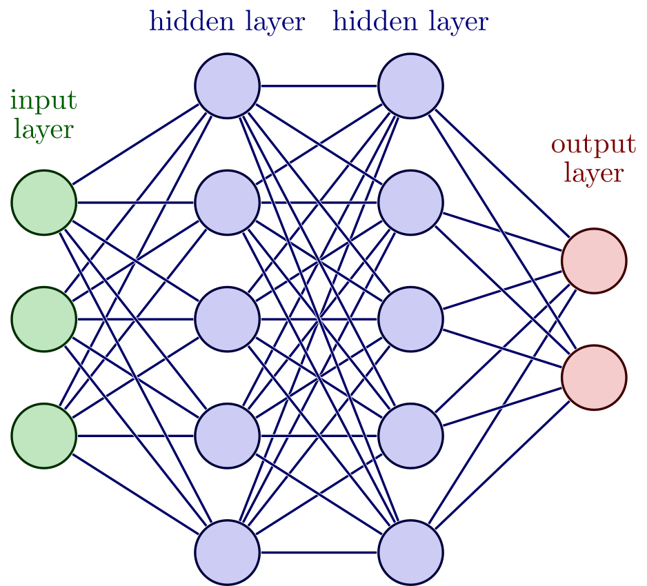
]
]

---
class: base24

# Framework

.left-column[
### Initial work
]

.right-column[

> Morala, P., Cifuentes, J. A., Lillo, R. E., **Ucar, I.** (2021a).
> _Towards a framework to inform neural network modelling via polynomial regression._
> _Neural Networks_, 142, 57–72.
> DOI: [10.1016/j.neunet.2021.04.036](https://doi.org/10.1016/j.neunet.2021.04.036)

Main merits:

- Find an **explicit expression** to build a polynomial from the .emph[weights]
  of a trained MLP, using a .emph[Taylor expansion] of the activation function
  - Limited to a single hidden layer and linear output
  - Weights need to be constrained for the expansion to remain valid
- Validated through a **simulation study**
]

---
class: base24

# Framework

.left-column[
### Initial work
### Notation
]

.right-column[
Polynomial of degree $k$ in $p$ variables:
$$z = \beta_{0} + \underbrace{\beta_{1} x_{1} + \dots + \beta_{p}x_{p}}_{1\mbox{-order interactions}} +\dots + \underbrace{\beta_{1 p\dots p}x_1x_p^{k-1} + \dots + \beta_{p\dots p}x_p^{k}}_{k\mbox{-order interactions}}$$
]

--

.right-column-append[
.pull-left[
Hidden layer, neuron $j$:
$$y_j = g(u_j) = g\left(\sum_{i=0}^p w_{ij} x_{i} \right)$$
Final output:
$$z=\sum_{j=0}^{h_1} v_{j} y_{j} = \sum_{j=0}^{h_1} v_{j} g\left(\sum_{i=0}^p w_{ij} x_{i} \right)$$
]

.pull-right[
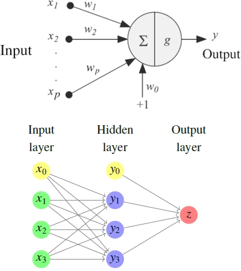
]
]

---
class: base24

# Framework

.left-column[
### Initial work
### Notation
### Tools
]

.right-column[
Taylor expansion of the activation function $g$:
$$y_j=g\left(\sum_{i=0}^pw_{ij}x_i\right)=\sum_{n=0}^{\infty}\frac{g^{(n)}(a)}{n!}{\color{blue}\left(\sum_{i=0}^pw_{ij}x_i-a\right)^n}$$

Binomial theorem:
$${\color{blue}\left(\sum_{i=0}^p w_{ij}x_{i}-a\right)^n} = \sum_{k=0}^n \binom{n}{k}(-a)^{n-k}{\color{magenta}\left(\sum_{i=0}^pw_{ij}x_i\right)^k}$$

Multinomial theorem:
$${\color{magenta}\left(\sum_{i=0}^p w_{ij}x_{i}\right)^k} = \sum_{m_{0}+\cdots+m_{p}=k}{\binom{k}{m_{0}, \dots, m_{p}}} (w_{0j}x_{0})^{m_{0}} \cdots (w_{pj}x_{p})^{m_{p}}$$
]

---
class: base24

# Framework

.left-column[
### Initial work
### Notation
### Tools
### Coefficients
]

.right-column[
Output expanded at $a=0$, truncated at degree $q$:
$$z\approx v_0+\sum_{j=1}^{h_1}v_j\sum_{n=0}^{q}\dfrac{g^{(n)}(0)}{n!}\left[\sum_{m_{0}+\cdots+m_{p}=n}{\binom{n}{m_{0}, \dots, m_{p}}} (w_{0j}x_{0})^{m_{0}} \cdots (w_{pj}x_{p})^{m_{p}}\right]$$

**Intercept:**
$$\beta_0=v_0+\sum_{j=1}^{h_1}v_j\left(\sum_{n=0}^{q}\frac{g^{(n)}(0)}{n!}w_{0j}^{n}\right)$$

**Interactions of order $T$:**
$$\beta_{t_1t_2\dots t_T}=\sum_{j=1}^{h_1}v_j\left(\sum_{n=T}^{q}\frac{g^{(n)}(0)}{(n-T)!\cdot m_1!\cdots m_p!} w_{0j}^{n-T}w_{1j}^{m_1}\dots w_{pj}^{m_p}\right)$$
]

---
class: base24

# Framework

.left-column[
### Initial work
### Notation
### Tools
### Coefficients
### $g$ expansion
]

.right-column[
.pull-left-mod[
Example: **softplus**
$$g(x)=\ln\left(1+e^x\right)$$

<br><br><br><br>Legend:
- Real function
- .red[Taylor expansion], order $q$
- .blue[Error] (difference)
]

.pull-right-mod[
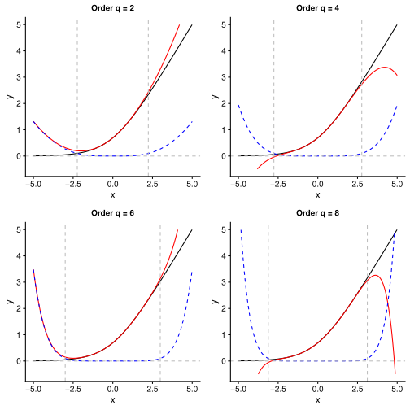
]
]

---
class: base24

# Simulation study

.left-column[
### Procedure
]

.right-column[
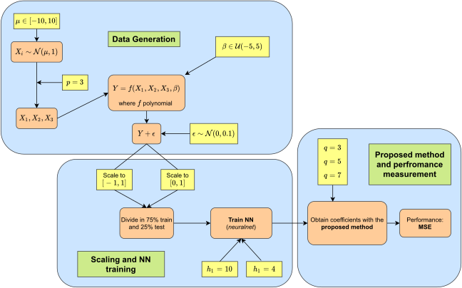
]

---
class: base24

# Simulation study

.left-column[
### Procedure
### Results I
]

.right-column[
.pull-left-mod[
(1) Good case<br>
(2) Bad case

<br><br><br><br><br><br>
(A) Response vs. Predicted NN<br>
(B) Predicted NN vs. Polynomial<br>
(C) Expansion validity region + <br>&emsp;&ensp;dist. of activations $u_j$
]

.pull-right-mod[
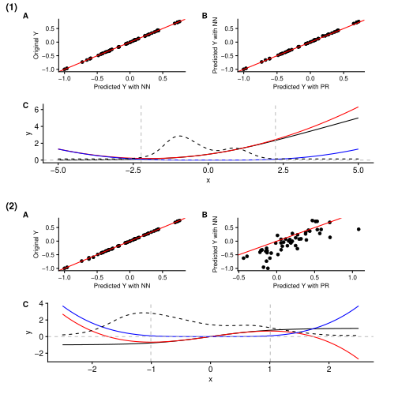
]
]

---
class: base24

# Simulation study

.left-column[
### Procedure
### Results I
### Performance I
]

.right-column[
.pull-left-mod[
- 500 MSE simulations
- Data scaled to $[-1, 1]$
]

.pull-right-mod[
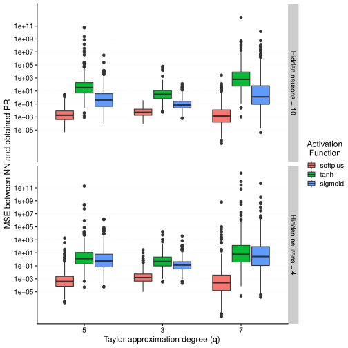
]
]

---
class: base24

# Simulation study

.left-column[
### Procedure
### Results I
### Performance I
### Surfaces I
]

.right-column[
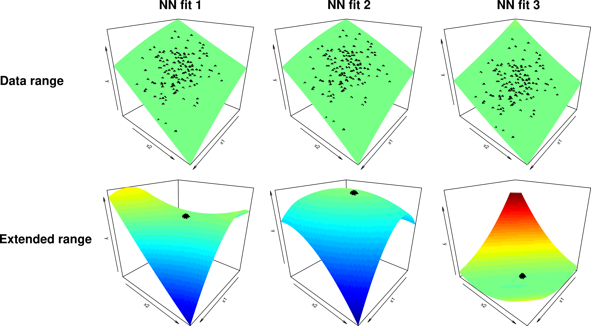
]

---
class: base24

# Framework

.left-column[
### Initial work
### Notation
### Tools
### Coefficients
### $g$ expansion
### Constraints
]

.right-column[
**Limited region** where Taylor expansion is accurate
]

--

.right-column-append[
- Impose an $\ell_1$-norm equal to one for the hidden layer weights:
  $$\left\lvert \left\lvert \vec{w}_{j} \right\rvert \right\rvert_1 = \sum_{i=0}^p \left\lvert w_{ij} \right\rvert = 1$$
- Then the **activations $u_j$ are also constrained** by 1 in absolute value:
  $$\lvert u_j \rvert = \left\lvert \sum_{i=0}^p w_{ij} x_{i} \right\rvert \leq  \sum_{i=0}^p \left\lvert w_{ij} x_{i} \right\rvert \leq  \sum_{i=0}^p \left\lvert w_{ij} \right\rvert = \left\lvert \left\lvert \vec{w}_{j} \right\rvert \right\rvert_1 = 1,$$
where $\left\lvert x_i\right\rvert \leq 1$ because of the $[-1,1]$ scaling. Therefore, $\left\lvert u_j\right\rvert \leq 1$
]

---
class: base24

# Simulation study

.left-column[
### Procedure
### Results I
### Performance I
### Surfaces I
### Results II
]

.right-column[
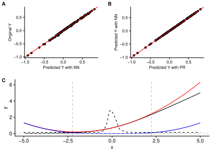
]

---
class: base24

# Simulation study

.left-column[
### Procedure
### Results I
### Performance I
### Surfaces I
### Results II
### Performance II
]

.right-column[
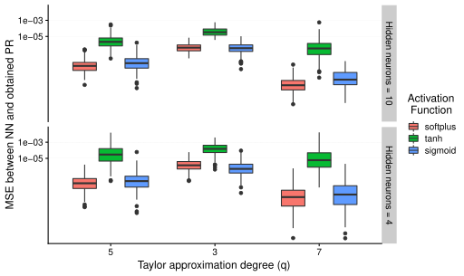
]

---
class: base24

# Simulation study

.left-column[
### Procedure
### Results I
### Performance I
### Surfaces I
### Results II
### Performance II
### Surfaces II
]

.right-column[
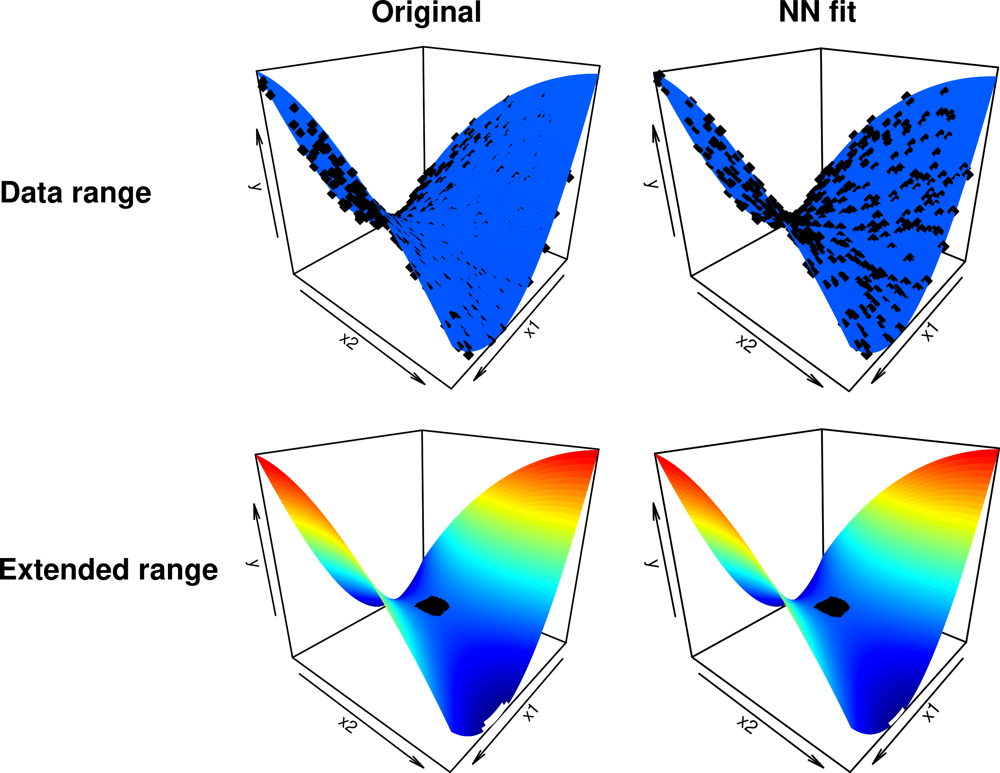
]

---
class: base24

# Framework

.left-column[
### Current status
]

.right-column[

> Morala, P., Cifuentes, J. A., Lillo, R. E., **Ucar, I.** (2021b).
> _NN2Poly: A polynomial representation for deep feed-forward artificial neural networks._
> _arXiv_ [stat.ML, cs.LG].
> DOI: [10.48550/arXiv.2112.11397](https://doi.org/10.48550/arXiv.2112.11397)

Main merits:
- **Extend** previous work to MLPs with an .emph[arbitrary number] of hidden layers
- **Extend** previous work to classification problems

Underway:
- Improve notation
- Model the error
]

---
class: base24

# Framework

.left-column[
### Current status
### Notation
]

.right-column[
Consider a MLP with $L-1$ hidden layers (0: input; $L$: output)

Output at layer $l$, neuron $j$:
$$\prescript{(l)}{}{y}_j = \prescript{(l)}{}{g}\left(\prescript{(l)}{}{u}_j\right) = \prescript{(l)}{}{g}\left(\sum_{i=0}^{h_{l-1}}\prescript{(l)}{}{w}_{ij}\prescript{(l)}{}{x}_i\right)$$

Polynomial at layer $l$, neuron $j$ of order $Q_{l-1}$ in $p$ variables:
$$\prescript{(l)}{}{P}_j\left(p,Q_{l-1}\right) = \sum_{\vec{t} \in \mathcal{T}(p,Q_{l-1})} \prescript{(l)}{}{B}_{j,\vec{t}}$$
where $B_{\vec{t}} = \beta_{\vec{t}} \cdot x_{t_1}\dots x_{t_T}$ and $\mathcal{T}(p,Q_{l-1})$ is the set of all possible interactions
]

---
class: base24

# Framework

.left-column[
### Current status
### Notation
### Algorithm
]

.right-column[
Using the first contribution, obtain the activation $\prescript{(2)}{}{u}_j \approx \prescript{(2)}{\mathrm{in}}{P}_j\left(p,Q_{1}\right)$
]

--

.right-column-append[
For $l=2\dots L-1$:
- Apply the Taylor expansion of the non-linearity $\prescript{(l)}{}{g}$:
  $$\prescript{(l)}{}{y}_j \approx \prescript{(l)}{}{g}\left(\prescript{(l)}{}{u}_j\right) \approx \prescript{(l)}{\mathrm{out}}{P}_j\left(p,Q_{l}\right)$$
]

--

.right-column-append[
- Obtain the activation $\prescript{(l+1)}{}{u}_j$ for each neuron $j$ at layer $l+1$:
  $$\prescript{(l+1)}{}{u}_j \approx \prescript{(l+1)}{\mathrm{in}}{P}_j\left(p,Q_{l}\right)$$
]

--

.right-column-append[
If it's a classification problem, apply the expansion of the non-linearity $\prescript{(L)}{}{g}$
]

---
class: base24

# Framework

.left-column[
### Current status
### Notation
### Algorithm
### Coefficients
]

.right-column[
**Interactions** at layer $l$, neuron $j$ after including $\prescript{(l)}{}{g}$ effect:
$$\prescript{(l)}{\mathrm{out}}{{\beta}}_{j,\vec{t}} = 
  \sum_{n=0}^{q_{l}}\dfrac{\prescript{(l)}{}{g}^{(n)}(0)}{n!}
  \sum_{ \vec{m} \in \pi(\vec{t},l,n)}
  \left(\begin{array}{c} n \\ \vec{m}_{p,Q_{l-1}} \end{array}\right)\prod_{k=1}^{M_{p,Q_{l-1}}} \prescript{(l)}{\mathrm{in}}{\beta}_{j,k}^{m_{k}}$$
where $\pi(\vec{t},l,n)$ is .emph[the set of all possible partitions] for a given combination of variables $\vec{t}$, layer $l$ and order $q_l$
    
**Interactions** for the linear case at layer $l+1$, neuron $j$:<br>
(e.g., when $l+1=L$ for the only output neuron in regression problems)
$$\prescript{(l+1)}{\mathrm{in}}{\beta}_{j,\vec{t}} = \sum_{i=0}^{h_{l}}\prescript{(l+1)}{}{w}_{ij} \cdot \prescript{(l)}{\mathrm{out}}{\beta}_{i,\vec{t}}$$
]

---
class: base24

# Simulation study

.left-column[
### Procedure
### Results I
### Performance I
### Surfaces I
### Results II
### Performance II
### Surfaces II
### Results III
]

.right-column[

Example with **several layers**:

- Output polynomial matches NN predictions
- The distribution of activations $\prescript{(l)}{}{u}_j$ is constrained at every hidden layer

.pull-left[
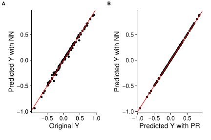
]
.pull-right[
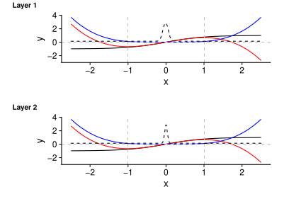
]
]

---
class: base24

# Summary

.left-column[
### Conclusions
]

.right-column[
**Main contribution**: An .emph[explicit formula] to obtain an .emph[equivalent] polynomial from the weights of a trained MLP
- The polynomial predicts as well (or as bad) as the NN
- **Main advantage**: .emph[interactions] vs. simple feature importance
]

--

.right-column-append[
The method provides polynomials **at each layer and neuron**, so it can be used to represent parts of a network by taking only the weights of a section and treating them like a smaller new NN
]

--

.right-column-append[
This framework can be used to **interpret** NNs predictions, **study** their properties and explore how to **tune** their hyperparameters
- And much more, e.g. explore how the training evolves
]

---
class: base24

# Summary

.left-column[
### Conclusions
### Open challenges
]

.right-column[
**Computationally expensive** combinatorial problem
- Equivalent to finding the partitions of the multiset $\vec t$
- Only one algorithm, by none other than... .emph[Donald Knuth]! in the 1980s
]

--

.right-column-append[
Explicit formula for the **error**, CIs for the coefficients
]

--

.right-column-append[
Applications to **real datasets**
- Is the polynomial representation unique?
]

--

.right-column-append[
Extensions to **other architectures** and non-tabular data
]

---
class: inverse, center, middle

# Wrap-up

---

# Vision and impact

.research-center-column[

## Interpretability of NN

- **NN2Poly** framework
- Error estimation
- Inform NN design
- Sensitivity analysis
- Extensions to other architectures
- ...

]


--

.research-left-column[

## Statistical software

- Computational issues
- Software packages

]


--

.research-right-column[

## Social applications

- **StatPhys4Cities**
  - interpretable mobility models
- ...

]


---
class: inverse, center, middle

# Thanks! Questions?

Slides created via the R package [**xaringan**](https://github.com/yihui/xaringan).

The chakra comes from [remark.js](https://remarkjs.com), [**knitr**](https://yihui.org/knitr/), and [R Markdown](https://rmarkdown.rstudio.com).

---
class: base24

# Appendix

.left-column[
### Combinatorial problem
]

.right-column[
The original variables $x_i$ are included in the terms $\prescript{(l)}{}{B}_{j,\vec{t}}$, and will depend on the exponents $m_k$

For a given coefficient $\prescript{(l)}{\mathrm{out}}{{\beta}}_{j,\vec{t}}$, all the products of terms $\prescript{(l)}{\mathrm{in}}{B}_{j,\vec{t}}$, that would yield the combination of variables determined by $\vec{t}$, need to be considered

Example:  consider $\prescript{(l)}{\mathrm{out}}{{\beta}}_{j,(1,1,2,3)}$, associated to $x_1^2x_2x_3$. This is included in the term $\prescript{(l)}{\mathrm{in}}{B}_{j,(1,1,2,3)}$, but also in the product of terms $\prescript{(l)}{\mathrm{in}}{B}_{j,(1,1)}\prescript{(l)}{a}{B}_{j,(2,3)}$ or in the product of the four terms $\prescript{(l)}{\mathrm{in}}{B}_{j,(1)}^2 \prescript{(l)}{\mathrm{in}}{B}_{j,(2)} \prescript{(l)}{\mathrm{in}}{B}_{j,(3)}$
]

---
class: base24

# Appendix

.left-column[
### Combinatorial problem
### Multiset partitions
]

.right-column[
Equivalent to finding all the possible partitions of the multiset $\vec t$

E.g., for $\{1,1,2,3\}$, these are:
$$\begin{matrix}\{1,1,2,3\} & \{1,1\},\{2,3\} & \{1\},\{3\},\{1,2\} \\ \{1\},\{1,2,3\} & \{1,2\},\{1,3\} & \{2\},\{3\},\{1,1\} \\ \{2\},\{1,1,3\} & \{1\},\{1\},\{2,3\} & \{1\},\{1\},\{2\},\{3\} \\ \{3\},\{1,1,2\} & \{1\},\{2\},\{1,3\} & \end{matrix}$$

Some restrictions apply to these partitions, as their size is limited by $q_l$ and the order of their elements is limited by $Q_{l-1}$
]
